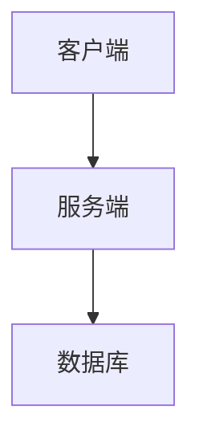

# 系统架构概览

> 本文档提供系统的整体架构视图，帮助团队成员快速理解系统结构

---

## 1. 系统概述

<!-- 描述系统的整体目标和定位 -->

---

## 2. 技术栈

| 层级 | 技术选型 | 说明 |
| ---- | -------- | ---- |
| -    | -        | -    |

---

## 3. 系统架构图

<!-- 插入架构图，可使用 Mermaid 或图片链接 -->

---

## 4. 模块划分

| 模块名称 | 职责 | 关键文件 |
| -------- | ---- | -------- |
| -        | -    | -        |

---

## 5. 数据流

<!-- 描述主要数据流和关键业务流程 -->

---

## 6. 部署架构

<!-- 描述生产环境部署结构 -->

---

## 更新记录

| 日期 | 更新内容       | 更新人 |
| ---- | -------------- | ------ |
| -    | 初始化架构文档 | -      |
